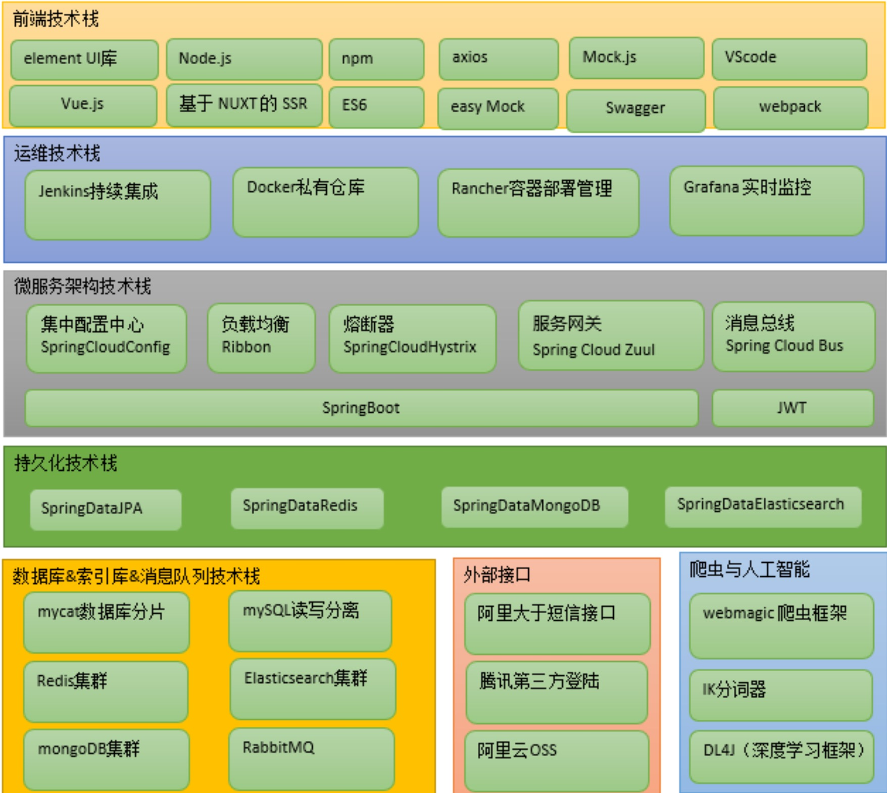

# 课程简介

## 《十次方设计系统》

​		系统整体分为 三大部分:微服务、网站前台、网站管理后台。功能模块包括文章、问答、招聘、活 动、吐槽、

交友、用户中心、搜索中心及第三方登陆等。

### 后端架构

​	SpringBoot+SpringCloud+SpringData+StringMVC(Spring全家桶)

### 前端架构

​	Node.js+Vue.js+ElementUI+NUXT

### 基础环境

```shell
JDK1.8

数据库mysql 5.7

开发工具 idea 2017.1.2

maven版本3.3.9

docker 最新版本

centos7

VMware Workstation Pro 12
```


### 架构图

​		


# 技术点学习

## UML建模

### Powerdesigner

​		用于架构业务使用，实际开发不使用

## 分布式ID生成器

​		由于我们的数据库在生产环境中要分片部署(MyCat),所以我们不能使用数据库本 身的自增功能来产生主键值，只能由程序来生成唯一的主键值。我们采用的是开源的 twitter( 非官方中文惯称:推特.是国外的一个网站，是一个社交网络及微博客服务) 的 snowflake (雪花)算法。

​		默认情况下41bit的时间戳可以支持该算法使用到2082年，10bit的工作机器id可以 支持1024台机器，序列号支持1毫秒产生4096个自增序列id . SnowFlake的优点是，整 体上按照时间自增排序，并且整个分布式系统内不会产生ID碰撞(由数据中心ID和机器ID 作区分)，并且效率较高，经测试，SnowFlake每秒能够产生26万ID左右


## Restful风格

​		GET/POST/PUT/DELETE/PATCH/HEAD/OPTIONS

​		REST 是Representational State Transfer的缩写，翻译是”表现层状态转化”。REST是所有Web应用都应该遵守的架构设计指导原则。

 		对于同一个资源的一组不同的操作。资源是服务器 上一个可命名的抽象概念，资源是以名词为核心来组织的，首先关注的是名词。REST要 求，必须通过统一的接口来对资源执行各种操作。对于每个资源只能执行一组有限的操 作。

### GET

```shell
安全且幂等
获取表示
变更时获取表示(缓存)
200(OK) - 表示已在响应中发出
204(无内容) - 资源有空表示
301(Moved Permanently) - 资源的URI已被更新 303(See Other) - 其他(如，负载均衡)
304(not modified)- 资源未更改(缓存)
400 (bad request)- 指代坏请求(如，参数错误) 404 (not found)- 资源不存在
406 (not acceptable)- 服务端不支持所需表示
500 (internal server error)- 通用错误响应
503 (Service Unavailable)- 服务端当前无法处理请求
```

### POST

```shell
不安全且不幂等
使用服务端管理的(自动产生)的实例号创建资源
创建子资源
部分更新资源
如果没有被修改，则不过更新资源(乐观锁)
200(OK)- 如果现有资源已被更改
201(created)- 如果新资源被创建
202(accepted)- 已接受处理请求但尚未完成(异步处理) 301(Moved Permanently)- 资源的URI被更新
303(See Other)- 其他(如，负载均衡)
400(bad request)- 指代坏请求
404 (not found)- 资源不存在
406 (not acceptable)- 服务端不支持所需表示
409 (conflict)- 通用冲突
412 (Precondition Failed)- 前置条件失败(如执行条件更新时的冲突) 415 (unsupported media type)- 接受到的表示不受支持
500 (internal server error)- 通用错误响应
503 (Service Unavailable)- 服务当前无法处理请求
```

### PUT

```shell
不安全但幂等
用客户端管理的实例号创建一个资源
通过替换的方式更新资源
如果未被修改，则更新资源(乐观锁)
200 (OK)- 如果已存在资源被更改
201 (created)- 如果新资源被创建
301(Moved Permanently)- 资源的URI已更改
303 (See Other)- 其他(如，负载均衡)
400 (bad request)- 指代坏请求
404 (not found)- 资源不存在
406 (not acceptable)- 服务端不支持所需表示
409 (conflict)- 通用冲突
412 (Precondition Failed)- 前置条件失败(如执行条件更新时的冲突) 415 (unsupported media type)- 接受到的表示不受支持
500 (internal server error)- 通用错误响应
503 (Service Unavailable)- 服务当前无法处理请求
```

### DELETE

```shell
不安全但幂等
删除资源
200 (OK)- 资源已被删除
301 (Moved Permanently)- 资源的URI已更改
303 (See Other)- 其他，如负载均衡
400 (bad request)- 指代坏请求
404 (not found)- 资源不存在
409 (conflict)- 通用冲突
500 (internal server error)- 通用错误响应
503 (Service Unavailable)- 服务端当前无法处理请求
```

## SpringCloud


### Feign

```
消费者和提供者均引入jar
<dependency>
    <groupId>org.springframework.cloud</groupId>
    <artifactId>spring-cloud-starter-openfeign</artifactId>
</dependency>
启动累添加注解@EnableFeignClients
消费端编写FeignClient 并指定要调用的服务名称


```


```java
"message": "com.netflix.client.ClientException: Load balancer does not have available server for client: tensquare-base",


思路：
  
1.修改eureka服务器配置   
eureka:  
  client:
    fetch-registry: true  # 搜索服务  
2.查看Feign Client中服务名配置是否正确
      
3.查看eureka中组册的服务名是否正确
      
4.服务提供者名字是否正确
```

### hystrix

```
feign集成hystrix 开启即可
feign:
  hystrix:
   enabled: true
```

### *zuul*

```
<dependency>
		<groupId>org.springframework.cloud</groupId>
		<artifactId>spring-cloud-starter-netflix-zuul</artifactId> </dependency>
```

```java

/**
* 头信息经过网关时头信息丢失，
*/
@Override
public Object run() throws ZuulException { 
  System.out.println("zuul过滤器..."); 
  //向header中添加鉴权令牌
	RequestContext requestContext = RequestContext.getCurrentContext(); 
  //获取header
	HttpServletRequest request = requestContext.getRequest(); 
  String authorization = request.getHeader("Authorization"); 			       	 if(authorization!=null&&"".equals(authorization)){
     	requestContext.addZuulRequestHeader("Authorization",authorization);      	 }
          return null;
}
```


## SpringDataJpa

条件查询

```
Caused by: java.lang.IllegalArgumentException: Not a managed type: class com.noxus.draven.recruit.pojo.Enterprise
	at org.hibernate.metamodel.internal.MetamodelImpl.managedType(MetamodelImpl.java:582) ~[hibernate-core-5.4.6.Final.jar:5.4.6.Final]
	at org.hibernate.metamodel.internal.MetamodelImpl.managedType(MetamodelImpl.java:85) ~[hibernate-core-5.4.6.Final.jar:5.4.6.Final]

```

find语法规范

```
findTop4ByStateOrderByCreatetimeDesc
```

## SpringDataRedis

```xml
<dependency>
  <groupId>org.springframework.boot</groupId> 
  <artifactId>spring‐boot‐starter-data-redis</artifactId>
</dependency>
```

```yaml
spring:
  redis:
    database: 0
    host: 116.196.77.250
    port: 6379
    lettuce:
      pool:
        max-active: 8
        max-idle: 8
        max-wait: -1ms
        min-idle: 0
```


## Spring Cache

```
@Caching-------定义复杂的缓存规则
@Cacheable-------使用这个注解的方法在执行后会缓存其返回结果。 
@CacheEvict--------使用这个注解的方法在其执行前或执行后移除Spring Cache中的某些
元素。
```

​		Spring Cache使用方法与Spring对事务管理的配置相似。Spring Cache的核心就是对某 个方法进行缓存，其实质就是缓存该方法的返回结果，并把方法参数和结果用键值对的 方式存放到缓存中，当再次调用该方法使用相应的参数时，就会直接从缓存里面取出指 定的结果进行返回。

## SpringDataMongoDB

https://projects.spring.io/spring-data-mongodb/

### MongoDB

​		https://www.mongodb.com/

​		MongoDB 是一个跨平台的，面向文档的数据库，是当前 NoSQL 数据库产品中最热门的一种。它介于关系数据库和非关系数据库之间，是非关系数据库当中功能最丰富，最像关系数据库的产品。它支持的数据结构非常松散，是类似 JSON 的 BSON 格式，因此可以存储比较复杂的数据类型。

#### 特点

​	它是一个面向集合的,模式自由的文档型数据库

 	(1)面向集合存储，易于存储对象类型的数据

 	(2)模式自由

 	(3)支持动态查询

 	(4)支持完全索引，包含内部对象

 	(5)支持复制和故障恢复 

 	(6)使用高效的二进制数据存储，包括大型对象(如视频等)

​	 (7)自动处理碎片，以支持云计算层次的扩展性

​	 (8)支持 Python，PHP，Ruby，Java，C，C#，Javascript，Perl 及 C++语言的驱动程序,社区中也提供了对 Erlang 及.NET 等平台的驱动程序

​	 (9) 文件存储格式为 BSON(一种 JSON 的扩展)

#### 体系结构

​		文档(document)、集合(collection)、数据库(database)这三部分组成的。逻辑结构是面 向用户的，用户使用 MongoDB 开发应用程序使用的就是逻辑结构。

  		(1)MongoDB 的文档(document)，相当于关系数据库中的一行记录。 

​		  (2)多个文档组成一个集合(collection)，相当于关系数据库的表。 

​		  (3)多个集合(collection)，逻辑上组织在一起，就是数据库(database)。 

​          (4)一个 MongoDB 实例支持多个数据库(database)。


​		数据库 	databases-- databases

​        集合 		collections -- table

 	   文档 		document -- row

#### 数据类型

##### 	基本数据类型

​	null  		用于表示控制或者不存在的字段 {"x":null}

​    布尔型 	布尔类型有两个值true/false {"x":true}

​    数值		 shell默认使用64为浮点型数值。{"x":3.14}{"x":3},整数值 可以使用 NumberInt NumberLong  {“x”:NumberInt(“3”)}{“x”:NumberLong(“3”)}

​	字符串	UTF-8字符串都可以表示为字符串类型的数据 {"x":"哈哈"}

   日期		 日期被存储为自新纪元依赖经过的毫秒数，不存储时区，{“x”:new Date()}

​	正则表达式	查询时，使用正则表达式作为限定条件，语法与JavaScript的正则表达式相同 {"x",'[abc]'}

​	数组		数据列表或数据集可以表示为数组 {“x”: [“a“，“b”,”c”]}

​	内嵌文档	文档可以嵌套其他文档，被嵌套的文档作为值来处理，{“x”:{“y”:3 }}

​	二进制数据	二进制数据是一个任意字节的字符串 他不能直接在shell中使用，若将非utf-字符保存到数据库中，二进制数据是唯一的方式

​	代码	查询和文档中可以包括任何JavaScript代码，{"x":function(){/.../}}

#### 安装

​            

```shell
connecting to: mongodb://127.0.0.1:27017/?compressors=disabled&gssapiServiceName=mongodb
Implicit session: session { "id" : UUID("6103fd5d-293a-4af1-929d-d212c32a7652") }
MongoDB server version: 4.2.3
> use test
switched to db test
> db.createUser({user:"tensqure",pwd:"tensqure",roles:[{role:'dbOwner',db:'config'}]})
2020-02-17T07:13:45.635+0000 E  QUERY    [js] uncaught exception: Error: couldn't add user: command createUser requires authentication :
_getErrorWithCode@src/mongo/shell/utils.js:25:13
DB.prototype.createUser@src/mongo/shell/db.js:1370:11
@(shell):1:1
> use tensquare
switched to db tensquare
> db.auth('tensquare','tensquare')
Error: Authentication failed.
0
> db.auth('tensqure','tensqure')
Error: Authentication failed.
0
> use tensquare


db.auth('root','root')


db.createUser({user:"kang",pwd:"kang",roles:[{role:'dbOwner',db:'config'}]})


docker run --name mongo -d \
-p 27018:27018 \
--privileged=true \
-v /docker/mongo/conf:/data/configdb \
-v /docker/mongo/data:/data/db \
docker.io/mongo:latest mongod -f /data/configdb/mongo.conf

docker run -di --name=tensquare_mongo -p 27017:27017 mongo
```

## RabbitMQ

### 消息队列		

​		消息队列中间件是分布式系统中重要的组件，主要解决应用耦合，异步消息，流量 削锋等问题实现高性能，高可用，可伸缩和最终一致性[架构] 使用较多的消息队列有 ActiveMQ，RabbitMQ，ZeroMQ，Kafka，MetaMQ，RocketMQ

### 介绍

  	 由 Erlang 语言开发的 AMQP 的开源实现

​		AMQP :Advanced Message Queue，高级消息队列协议。它是应用层协议的一个开放 标准，为面向消息的中间件设计，基于此协议的客户端与消息中间件可传递消息，并不 受产品、开发语言等条件的限制

### 特点

​	RabbitMQ 最初起源于金融系统，用于在分布式系统中存储转发消息，在易用性、扩展 性、高可用性等方面表现不俗。具体特点包括:

​	1.可靠性(Reliability)
 	RabbitMQ 使用一些机制来保证可靠性，如持久化、传输确认、发布确认。 

​	2.灵活的路由(Flexible Routing)

​	在消息进入队列之前，通过 Exchange 来路由消息的。对于典型的路由功能，RabbitMQ 已经提供了一些内置的 Exchange 来实现。针对更复杂的路由功能，可以将多个 Exchange 绑定在一起，也通过插件机制实现自己的 Exchange 。

​	3.消息集群(Clustering)

​	多个 RabbitMQ 服务器可以组成一个集群，形成一个逻辑 Broker 。

​	4.高可用(Highly Available Queues)

​	队列可以在集群中的机器上进行镜像，使得在部分节点出问题的情况下队列仍然可用。

​	5.多种协议(Multi-protocol)

RabbitMQ 支持多种消息队列协议，比如 STOMP、MQTT 等等。

​	6.多语言客户端(Many Clients)

RabbitMQ 几乎支持所有常用语言，比如 Java、.NET、Ruby 等等。

​	7.管理界面(Management UI)

​	RabbitMQ 提供了一个易用的用户界面，使得用户可以监控和管理消息 Broker 的许多方 面。

​	8.跟踪机制(Tracing)
 	如果消息异常，RabbitMQ 提供了消息跟踪机制，使用者可以找出发生了什么。 9.插件机制(Plugin System)RabbitMQ 提供了许多插件，来从多方面进行扩展，也可以编写自己的插件。

### 架构图

#### 概念

##### RabbitMQ Server:

​		也叫broker server，它是一种传输服务。 他的角色就是维护一条

从Producer到Consumer的路线，保证数据能够按照指定的方式进行传输。

##### Producer

​	 消息生产者，如图A、B、C，数据的发送方。消息生产者连接RabbitMQ服

务器然后将消息投递到Exchange。 Consumer:消息消费者，如图1、2、3，数据的接收方。消息消费者订阅队列，

##### RabbitMQ

​		将Queue中的消息发送到消息消费者。

Exchange:生产者将消息发送到Exchange(交换器)，由Exchange将消息路由到一个 或多个Queue中(或者丢弃)。Exchange并不存储消息。RabbitMQ中的Exchange有 direct、fanout、topic、headers四种类型，每种类型对应不同的路由规则。

##### Queue:(队列)

​		是RabbitMQ的内部对象，用于存储消息。消息消费者就是通过订阅 队列来获取消息的，RabbitMQ中的消息都只能存储在Queue中，生产者生产消息并最终 投递到Queue中，消费者可以从Queue中获取消息并消费。多个消费者可以订阅同一个 Queue，这时Queue中的消息会被平均分摊给多个消费者进行处理，而不是每个消费者 都收到所有的消息并处理。

##### RoutingKey

​		生产者在将消息发送给Exchange的时候，一般会指定一个routing key， 来指定这个消息的路由规则，而这个routing key需要与Exchange Type及binding key联 合使用才能最终生效。在Exchange Type与binding key固定的情况下(在正常使用时一 般这些内容都是固定配置好的)，我们的生产者就可以在发送消息给Exchange时，通过 指定routing key来决定消息流向哪里。RabbitMQ为routing key设定的长度限制为255 bytes。

##### Connection: (连接):

​		Producer和Consumer都是通过TCP连接到RabbitMQ Server 的。以后我们可以看到，程序的起始处就是建立这个TCP连接。

##### Channels: (信道)

​		它建立在上述的TCP连接中。数据流动都是在Channel中进行 的。也就是说，一般情况是程序起始建立TCP连接，第二步就是建立这个Channel。

##### VirtualHost

 	权限控制的基本单位，一个VirtualHost里面有若干Exchange和 MessageQueue，以及指定被哪些user使用

### 模式

#### 	直连模式Direct(自带负载均很)

​		任何发送到Direct Exchange的消息都会被转发到RouteKey中制定的Queue

​	一般情况下可以使用rabbitMQ自带的Exchange “”。该交换器的名字为空字符串，default Exchange

这种模式下不需要讲Exchange进行任何绑定操作

消息传递时需要一个RouteKey 可以简单的理解为要发送的队列名字

如果vhost中不存在RouteKey中指定的队列名，则该消息会被抛弃


Durability:是否做持久化 Durable(持久) transient(临时) Auto delete : 是否自动删除


```java
Caused by: com.rabbitmq.client.ShutdownSignalException: channel error; protocol method: #method<channel.close>(reply-code=404, reply-text=NOT_FOUND - no queue 'draven' in vhost '/', class-id=50, method-id=10)
  
不存在此消息队列
```

#### 分列模式(Fanout)

任何发送到Fanout Exchange的消息都会被转发到与该Exchange绑定的多有QUeue上

1.可以理解为路由表模式

2.这种模式不需要RouteKey

3.这种模式需要提前将Exchange与Queue进行绑定，一个Exchange可以绑定多个Queue，一个Queue可以同多个Exchange进行绑定

4.如果接收到消息的Exchange没有与任何Queue绑定，则消息会被抛弃


#### 主题模式(Topic)

1.这种模式比较复杂 每个队列都有其关心的主题，所有的消息都带有一个标题RouteKey Exchange会将消息转发到所有关注主题能与RouteKey模糊匹配的队列

2.这种模式需要RouteKey，也需要提前绑定Exchange与Queue

3.在进行绑定时，要提供一个该队列关心的主题，如#.log.#表示该队列关心的所有涉及log的消息

4.# 表示0或若干个关键字 “”表示一个关键字

5.同样，若果Exchange没有发现能够与RouteKey匹配的Queue，则会抛弃此消息

## ElasticSearch

​		https://www.cnblogs.com/chowmin/articles/4629220.html

​		Elasticsearch是一个实时的分布式搜索和分析引擎。它可以帮助你用前所未有的速 度去处理大规模数据。ElasticSearch是一个基于Lucene的搜索服务器。它提供了一个分 布式多用户能力的全文搜索引擎，基于RESTful web接口。Elasticsearch是用Java开发 的，并作为Apache许可条款下的开放源码发布，是当前流行的企业级搜索引擎。设计用 于云计算中，能够达到实时搜索，稳定，可靠，快速，安装使用方便

### 特点

(1)可以作为一个大型分布式集群(数百台服务器)技术，处理PB级数据，服务大公司;也可以运行在单机上 

(2)将全文检索、数据分析以及分布式技术，合并在了一起，才形成了独一无二的ES; 

(3)开箱即用的，部署简单 

(4)全文检索，同义词处理，相关度排名，复杂数据分析，海量数据的近实时处理

### 体系结构

索引	index			databases

类型	type			  table

文档	document	row


### 测试

```shell
# 创建索引put
http://ip:9200/articleindex/
# 新建文档post
http://ip:9200/articleindex/article
{
  "title":"SpringBoot2.0",
  "content":"发布啦"
}
{
  "_index": "articleindex", "_type": "article",
  "_id": "AWPKsdh0FdLZnId5S_F9", "_version": 1,
  "result": "created", 
  "_shards": {
      "total": 2, 
      "successful": 1, 
      "failed": 0
  },
  "created": true
}
# 查询
http://ip:9200/articleindex/article/_search

# 修改
http://ip:9200/articleindex/article/AWPKrI4pFdLZnId5S_F7
```


```shell
./logstash -e 'input { stdin { } } output { stdout {} }' -f


./logstash -f ../config/mysql.conf
```


环境搭建数据同步mysql->elasticsearch

```java
input { 
		jdbc {
					# mysql jdbc connection string to our backup databse 后面的test 对应mysql中的test数据库
            jdbc_connection_string=>"jdbc:mysql://116.196.77.250:3306/tensquare_article?characterEncoding=UTF8"
					# the user we wish to excute our statement as
					jdbc_user => "root"
					jdbc_password => "root"
					# the path to our downloaded jdbc driver 
					jdbc_driver_library => "/docker/logstash/mysql-connector-java-8.0.15.jar"
					# the name of the driver class for mysql
					jdbc_driver_class => "com.mysql.jdbc.Driver" jdbc_paging_enabled => "true" 
					jdbc_page_size => "50000" #以下对应着要执行的sql的绝对路径。
					statement => "select id,title,content from tb_article"
					#定时字段 各字段含义(由左至右)分、时、天、月、年，全部为*默认含义为 每分钟都更新
					schedule => "* * * * *" }
}
output {
    elasticsearch {
          #ESIP地址与端口
          hosts => "116.196.77.250:9200" #ES索引名称(自己定义的) index => "tensquare" #自增ID编号
          document_id => "%{id}" document_type => "article"
        } 
 		stdout {
          #以JSON格式输出
          codec => json_lines }
}
```

## RabbitMQ


## Lombok

```java
@Builder
@NoArgsConstructor
@AllArgsConstructor
```


## 异常处理

```java
package com.noxus.draven.base.controller.exceptions;

import com.noxus.draven.common.entity.Result;
import com.noxus.draven.common.entity.StatusCode;
import org.springframework.web.bind.annotation.ControllerAdvice;
import org.springframework.web.bind.annotation.ExceptionHandler;
import org.springframework.web.bind.annotation.ResponseBody;

/**
 * 统一异常处理类
 */
@ControllerAdvice
public class BaseExceptionHandler {
    @ExceptionHandler(value = Exception.class)
    @ResponseBody
    public Result error(Exception e) {
        e.printStackTrace();
        return new Result(false, StatusCode.ERROR, e.getMessage());
    }
}
```

## 跨域

```
@CrossOrigin

CORS(Cross-Origin Resource Sharing, 跨源资源共享)是W3C出的一个标准，其思 想是使用自定义的HTTP头部让浏览器与服务器进行沟通，从而决定请求或响应是应该成 功，还是应该失败。因此，要想实现CORS进行跨域，需要服务器进行一些设置，同时前 端也需要做一些配置和分析
```

# Docker环境

## MySQL

见《mysql安装》

```shell
docker run -p 3306:3306 \
--name mysql5.7 \
-e MYSQL_ROOT_PASSWORD=root \
--privileged=true \
-v /docker/mysql7/data:/var/lib/mysql \
-v /docker/mysql7/conf/my.cnf:/etc/mysql/conf.d/mysql.cnf \
-d \
docker.io/mysql:5.7
```


```xml
<dependency>
    <groupId>mysql</groupId>
    <artifactId>mysql-connector-java</artifactId>
    <version>5.1.4</version>
</dependency>
```

## Redis

见《redis安装》

## MongoDB

```shell
mongo 192.168.184.134
use database
db.collection.insert(value)
db.collection.find()
db.collection.find({field:value})
db.collection.find().limit(3)
db.collection.update(where，data)
db.collection({},{$set:{data}})
db.collection.remove({where})
db.collection.count({where})
db.collection.find({field:/value/})
db.collection.find({field:/^value/})
db.collection.find({field:{$gt:value}})
db.collection.find({field:{$lt:value}})
db.collection.find({field:{$gte:value}})
db.collection.find({field:{$lte:value}})
db.collection.find({field:{$nt:value}})
db.collection.find({field:{$in:[value,value]}})
db.collection.find({field:{$nin:[value,value]}})
db.collection.find({$and:[{field:{$gte:value},{field:{$lt:value}}}]})
db.collection.find({$or:[{field:{$gte:value},{field:{$lt:value}}}]})
db.collection.update({{where},{$inc:{field:value}}})
```

# 工具

## Postman

## IDEA

```shell
IDEA 生成getter and setter的快捷键是Alt+Insert
```


# SpringCloud


```java
Error creating bean with name 'traceFilterRegistration' defined in class path resource 
```


```yaml
server:
 port: 9011
spring:
 application:
  name: tensquare‐manager #指定服务名 
eureka:
 client:
  serviceUrl: #Eureka客户端与Eureka服务端进行交互的地址
   defaultZone: http://127.0.0.1:6868/eureka/ 
 instance:
  prefer‐ip‐address: true 
zuul:
 routes:
  tensquare‐gathering: #活动
   path: /gathering/** #配置请求URL的请求规则
   serviceId: tensquare‐gathering #指定Eureka注册中心中的服务id 
  tensquare‐article: #文章
   path: /article/** #配置请求URL的请求规则
   serviceId: tensquare‐article #指定Eureka注册中心中的服务id 
  tensquare‐base: #基础
    path: /base/** #配置请求URL的请求规则
    serviceId: tensquare‐base #指定Eureka注册中心中的服务id 
  tensquare‐friend: #交友
   path: /friend/** #配置请求URL的请求规则
   serviceId: tensquare‐friend #指定Eureka注册中心中的服务id 
  tensquare‐qa: #问答
   path: /qa/** #配置请求URL的请求规则
   serviceId: tensquare‐qa #指定Eureka注册中心中的服务id 
  tensquare‐recruit: #招聘
   path: /recruit/** #配置请求URL的请求规则
   serviceId: tensquare‐recruit #指定Eureka注册中心中的服务id 
  tensquare‐spit: #吐槽
   path: /spit/** #配置请求URL的请求规则
   serviceId: tensquare‐spit #指定Eureka注册中心中的服务id 
  tensquare‐user: #用户
   path: /user/** #配置请求URL的请求规则
   serviceId: tensquare‐user #指定Eureka注册中心中的服务id
```

# Devops

## Dockerfile

​		Dockerfile是由一系列命令和参数构成的脚本，这些命令应用于基础镜像并最终创建一个 新的镜像

FROM image_name:tag 定义了使用哪个基础镜像启动构建流程

MAINTAINER user_name 声明镜像的创建者

ENV key value 设置环境变量 (可以写多条)

RUN command 是Dockerfile的核心部分(可以写多条)

ADD source_dir/file dest_dir/file 将宿主机的文件复制到容器内，如果是一个压缩文件， 将会在复制后自动解压

COPY source_dir/file dest_dir/file 和ADD相似，但是如果有压缩文件并不能解压

WORKDIR path_dir 设置工作目录

EXPOSE port1 prot2 用来指定端口，使容器内的应用可以通过端口和外界交
互

CMD argument 在构建容器时使用，会被docker run 后的argument覆 盖

VOLUME 将本地文件夹或者其他容器的文件挂载到容器中


```shell
#依赖镜像名称和ID FROM centos:7 #指定镜像创建者信息 MAINTAINER ITCAST #切换工作目录 WORKDIR /usr
RUN mkdir /usr/local/java
#ADD 是相对路径jar,把java添加到容器中
ADD jdk‐8u171‐linux‐x64.tar.gz /usr/local/java/
#配置java环境变量
ENV JAVA_HOME /usr/local/java/jdk1.8.0_171
ENV JRE_HOME $JAVA_HOME/jre
ENV CLASSPATH $JAVA_HOME/lib/dt.jar:$JAVA_HOME/lib/tools.jar:$JRE_HOME/lib:$CLASSPATH ENV PATH $JAVA_HOME/bin:$PATH
```

```shell
docker build ‐t='jdk1.8' .
docker images
docker run ‐it ‐‐name=myjdk8 jdk1.8 /bin/bash
```


```shell
容器管理工具
docker run -d --name=rancher  --restart=always -p 9090:8080 rancher/server

--启动mysql
docker run -di --name=tensquare_mysql -p 3306:3306 -e MYSQL_ROOT_PASSWORD=123456 centos/mysql-57-centos7

--启动redis
docker run -di --name=tensquare_redis -p 6379:6379 redis

--启动mongoDb
docker run -di --name=tensquare_mongo -p 27017:27017 mongo

--启动rabbitMq
docker run -di --name=tensquare_rabbitmq -p 5671:5671 -p 5672:5672 -p 4369:4369 -p 15671:25671 -p 15672:15672 -p 25672:25672 rabbitmq:management

--启动私服
docker run -di --name=registry -p 5000:5000 registry

gogs代码管理工具
docker run -d --name=gogs -p 10022:22 -p 3000:3000 -v /var/gogsdata:/data gogs/gogs

--elasticsearch start

--单机版本elasticsearch
docker run -di --name=tensquare_es -p 9200:9200 -p 9300:9300 elasticsearch:5.6.8

--查看容器内部信息
docker exec -it tensquare_elasticsearch /bin/bash
docker exec -it tensquare_es /bin/bash
--切换目录
cd /config
--推出指令
exit

docker cp tensquare_es:/usr/share/elasticsearch/config/elasticsearch.yml /usr/share/elasticsearch.yml
--创建镜像（使用宿主机配置文件）
docker run -di --name=tensquare_es -p 9200:9200 -p 9300:9300  -v /usr/share/elasticsearch.yml:/usr/share/elasticsearch/config/elasticsearch.yml elasticsearch:5.6.8

--配置IK分词器
docker cp ik tensquare_es:/usr/share/elasticsearch/plugins

--拉取heah插件
docker pull mobz/elasticsearch-head

--运行heah插件
docker run -di --name=temsquare_header -p 9100:9100 mobz/elasticsearch-head:5


--elasticsearch end

部署为镜像文件以后启动命令
docker run -d --name=tensquare_config -p 12000:12000 192.168.200.133:5000/tensquare_config:1.0-SNAPSHOT
```

