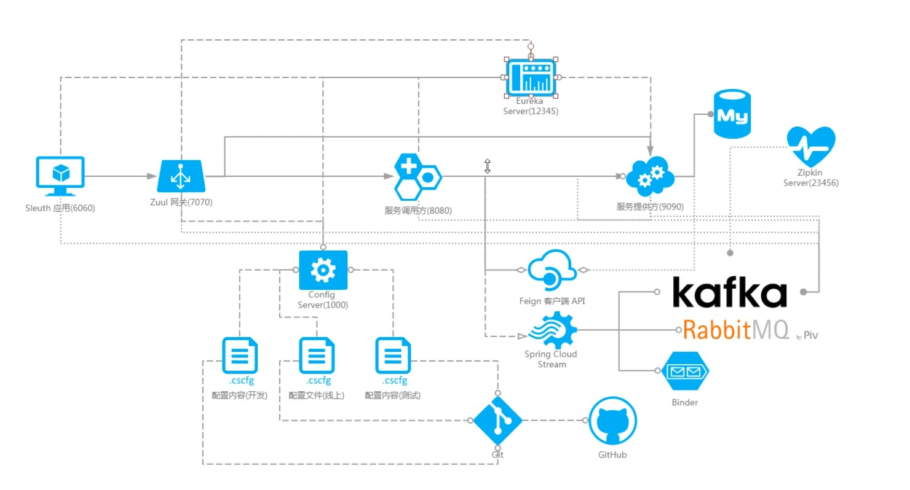
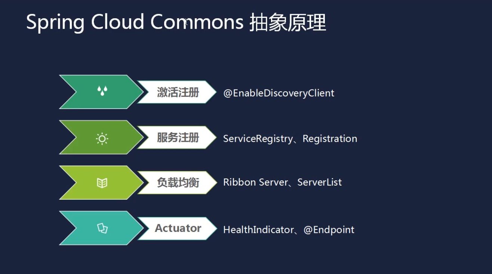
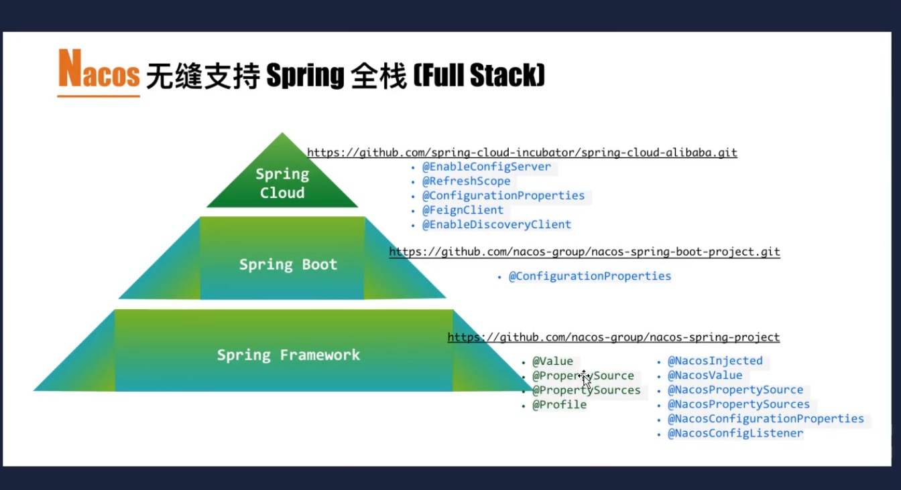
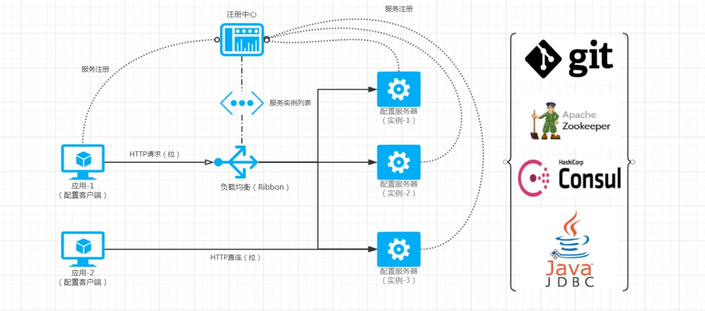

# 架构



# 服务发现

## 抽象原理



## eureka


## zookeeper


## consule


## Nacos




# 分布式配置

## SpringCloud分布式配置



 


## Nacos Config

# SaaS

[	SaaS](https://baike.baidu.com/item/SaaS)平台是运营saas软件的平台。SaaS提供商为企业搭建信息化所需要的所有网络基础设施及软件、硬件运作平台，并负责所有前期的实施、后期的维护等一系列服务，企业无需购买软硬件、建设[机房](https://baike.baidu.com/item/机房/5066792)、招聘IT人员，即可通过[互联网](https://baike.baidu.com/item/互联网/199186)使用信息系统。SaaS 是一种软件布局模型，其应用专为[网络](https://baike.baidu.com/item/网络/143243)交付而设计，便于用户通过互联网托管、部署及接入。

# PaaS


# Iaas


# BaaS


# 架构体系

Spring Boot

Spring Cloud

Netflix+Spring Boot


Spring Cloud Alibaba

Spring+boot+alibaba

# Netflix


# Ubuntu

```shell
sudo -i
pwd
whoami
passwd

flm@flm:/$ sudo ifconfig ens33 192.168.1.105
记住要加sudo，不然的话可能不会成功
然后是网络重启
flm@flm:/$ sudo service network-manager restart
但是我的电脑没有重启网络，在windows端还是照样能ping通


sudo gedit /etc/network/interfaces

# interfaces(5) file used by ifup(8) and ifdown(8)
auto lo
iface lo inet loopback

auto ens33
iface ens33 inet static
address 192.168.152.10
netmask 255.255.255.0
gateway 192.168.152.2

dns-nameservers 223.5.5.5

/etc/init.d/networking restart
```

## Apt

```shell
lsb_release -a
```


## 安装docker

```shell
curl -fsSL get.docker.com -o get-docker.sh
# 修改镜像源
sh get-docker.sh --mirror Aliyun
# 载入配置文件
systemctl daemon-reload
# 重新启动docker
systemctl restart docker
```


## 安装GitLab

```yaml
version: '3'
services:
    web:
      image: 'gitlab/gitlab-ce'
      restart: always
      hostname: '192.168.200.143'
      environment:
        TZ: 'Asia/Shanghai'
        GITLAB_OMNIBUS_CONFIG: |
          external_url 'http://192.168.200.143:8080'
          gitlab_rails['gitlab_shell_ssh_port'] = 2222
          unicorn['port'] = 8888
          nginx['listen_port'] = 8080
      ports:
        - '8080:8080'
        - '8443:443'
        - '2222:22'
      volumes:
        - /usr/local/docker/gitlab/config:/etc/gitlab
        - /usr/local/docker/gitlab/data:/var/opt/gitlab
        - /usr/local/docker/gitlab/logs:/var/log/gitlabs
```


```shell
docker-compose up
```

