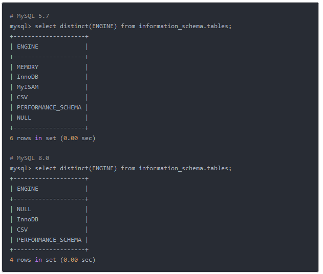
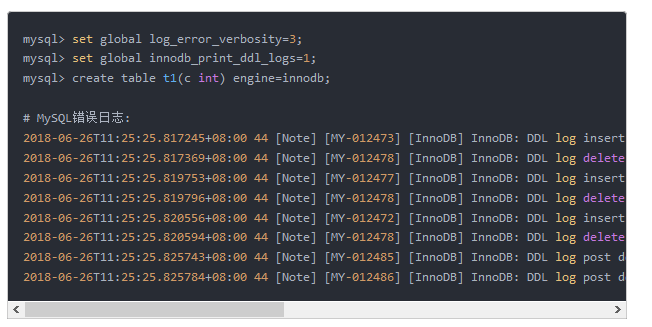

# 0.学习目标

- 异常信息
- MySQL 8.0 介绍


# 1.异常信息

## 1.1 连接异常

	--原因：需要配置时区，并且驱动也进行了调整

## 1.2 java.sql.SQLNonTransientConnectionException: Public Key Retrieval is not allowed

	--原因：
	
	--解决方案：&allowPublicKeyRetrieval=true

## 正确配置
	#datasource
  datasource:
    driver-class-name: com.mysql.cj.jdbc.Driver
    url: jdbc:mysql://127.0.0.1:3306/xxx?characterEncoding=utf8&serverTimezone=UTC&useSSL=false&allowPublicKeyRetrieval=true
    username: root
    password: root
    hikari:
      maximum-pool-size: 30
      minimum-idle: 10


```yaml
spring:
  datasource:
    username: root
    password: 1234
    url: jdbc:mysql://localhost:3306/springboot?useUnicode=true&characterEncoding=utf-8&useSSL=true&serverTimezone=UTC
    driver-class-name: com.mysql.jdbc.Driver
```

# 2.简单介绍

## 1.2 特性集锦
 -来源 https://www.jianshu.com/p/be29467c2b0c

# 1. 默认字符集由latin1变为utf8mb4

在8.0版本之前，默认字符集为latin1，utf8指向的是utf8mb3，8.0版本默认字符集为utf8mb4，utf8默认指向的也是utf8mb4。

# 2. MyISAM系统表全部换成InnoDB表

系统表全部换成事务型的innodb表，默认的MySQL实例将不包含任何MyISAM表，除非手动创建MyISAM表。



# 3. 自增变量持久化
在8.0之前的版本，自增主键AUTO_INCREMENT的值如果大于max(primary key)+1，在MySQL重启后，会重置AUTO_INCREMENT=max(primary key)+1，

这种现象在某些情况下会导致业务主键冲突或者其他难以发现的问题。自增主键重启重置的问题很早就被发现(https://bugs.mysql.com/bug.php?

id=199)，一直到8.0才被解决，8.0版本将会对AUTO_INCREMENT值进行持久化，MySQL重启后，该值将不会改变。

#4. DDL原子化
--InnoDB表的DDL支持事务完整性，要么成功要么回滚，将DDL操作回滚日志写入到data dictionary 数据字典表 mysql.innodb_ddl_log 中用于回滚

操作，该表是隐藏的表，通过show tables无法看到。通过设置参数，可将ddl操作日志打印输出到mysql错误日志中。

mysql> set global log_error_verbosity=3;
mysql> set global innodb_print_ddl_logs=1;
mysql> create table t1(c int) engine=innodb;

